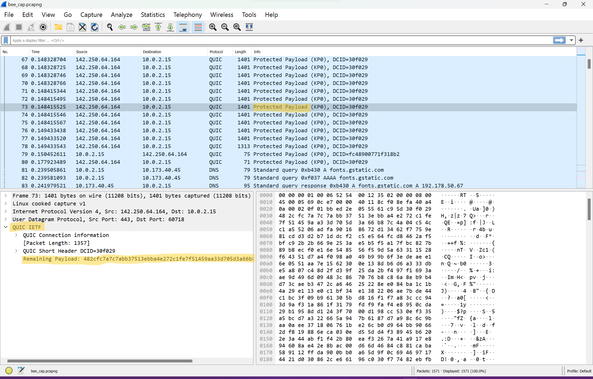

# CyberBee
Cyber challenge for the February 23rd Hack@UCF general body meeting. Ping @Jack.py on Discord with the flag.

Feel free to ping @Jack.py with any questions, comments, or concerns!

Flag format: hack@ucf{*flag-name*}

## Background
Buzzing Wings Aerial Pollinators Platform (bWAPP) is in a bit of a buzz right now. Their brand new web based blog feature was hacked! As the new cyber intern, and the only cyber specialist in the company, it is your time to shine. 

Your supervisor needs you to take a look at a packet capture file taken during the attack to find out what happened and what the bad actor stole. There is rumors the bad actor may have breached the CEOs personal information. Can you find what the bad actor stole from the bWAPP CEO before he gets back from vacation?

## Guided questions
1. What is the login name of the user who attacked?
2. What kind of attack was used?
3. What is the login name of the CEO?
4. What did the bad actor steal

Note: You only need to submit the flag but hopefully these questions can help you work your way through the challenge.

## Resources
+ [Wireshark](https://www.wireshark.org/) - recommended for analyzing the pcap
+ [bWAPP](http://www.itsecgames.com/) - actually stands for Buggy Web Application and is a great resource for practicing your web exploits LEGALLY!

## Write up

### Initial setup
 - Download a network protocol analyzer as we must analyze this packet capture file (.pcap). I am a fan of Wireshark as it provides a nice GUI. But if you are a command line wizard tshark and tcpdump are good command line tools.
 
 - On a network, information is sent via packets. Packets have a header, which includes the source, destination, and other important information, and a payload, which has the data being sent. All of this is stored as binary making it almost impossible for us to read on our own. That is where our network protocol analyzer comes in. Wireshark, or whatever else you use, allows you to not only see the original binary but also convert and categorize the information back to being human-readable. This can help us with our challenge!

 + SO much information...where do I start?
  - Once you open the pcap file you are hit with 1571 packets! This can be overwhelming. Let's start by narrowing down the amount of packets we have to analyze. Many of these packets are just junk that we either can't read or are unimportant to our cause. So let's find out which ones those are.

[Image of protocols](assets/img3proto.png)
    
  - Wireshark has tons of cool features to mess around with and narrow your search. But for now, let's focus on the statistics tab. Here are a few useful tools in the statistics tab that may help, navigate to:
  1. Statistics > Protocol Hierarchy: will show the types and number of protocols sent.
  2. statistics > conversations: will show IPs that were communicating with each other. This could be useful when analyzing the source and target of an attack.
  3. statistics > I/O graph: will show the frequency and time of packet received in a graphical format.

### What are all these protocols?
 A protocol is a guideline for data transfer throughout a network. There are tons of protocols. But let's break down the protocols in our capture using our new statistic tool. 

 
 
 - [QUIC](https://www.auvik.com/franklyit/blog/what-is-quic-protocol/): There seems to be a TON of this in our capture. But what is it? QUIC is a transport layer protocol that creates reliable, secure, and quick connections over the internet. QUIC is built off of UDP hence the quickness and uses TLS to encrypt traffic. This is evident in our capture as every time you inspect a QUIC packet you can see that the payload is protected. This may be a problem for us.

   [Three way handshake](assets/img2tcp.png)
   
 - [TCP](https://www.geeksforgeeks.org/what-is-transmission-control-protocol-tcp/): Transfer Control Protocol also takes up a decent amount of our capture. TCP is another transport layer protocol that ensures reliable connection for users. Unlike UDP, TCP employs a three-way handshake (SYN, SYN-ACK, ACK) to verify a connection between devices before data is transmitted. This causes some latency hence the reason for UDP and QUIC's...well...quickness. In Wireshark, it looks like we captured a handshake in packets 701-717. This could be useful.
   
 - [HTTP](https://developer.mozilla.org/en-US/docs/Web/HTTP/Overview): Hyper Transfert Text Protocol. Now this is where things get interesting. HTTP is commonly used to send and receive data on the internet. You are probably using a similar version, HTTP Secure AKA HTTPS, to view this repo right now. Lucky for us we are dealing with an unsecure HTTP protocol. HTTP is notorious for sending data in plaintext, or text we can easily read, especially HTML files! Since we know from the challenge that the bWAPP website was hacked these HTTP packets may have something to do with the attack.

### The search is on.
-  Now that we have narrowed down our search to a specific protocol let's clear the junk. Use Wireshark's filter bar to type the word "http" thus showing only HTTP protocols. This filter bar can also be used for tons of other display filters when analyzing captures.

  [Viewing the POST requests](assets/img4post.png)

 - We can see a smaller amount of HTTP protocols now. Some include the word ["POST"](https://developer.mozilla.org/en-US/docs/Web/HTTP/Methods/POST), what are those? A POST is a method to send data to be processed by a web server. This could be images, files, or in our case possibly this is a user submitting a post to the bWAPP blog feature. These POST requests are alternatively followed by a 200 OK response. This is the server responding to the POST request validating the recieval of the POST and sending back a response to the request. You can see that along with 200 OK responses, there seems to be (text/html). Now we are talking human-readable text!

 - Let's analyze that POST request first to see what the user was sending to the server. As we are dealing with an attack, we want to know if anything sent to our server was malicious. Sure enough, when we inspect any of the POST packets there doesn't seem to be a friendly neighborhood blog post being sent. In the "HTML Form URL Encoded" tab on the bottom left we can see that our blog's entry seems to be Form item: "nothing', (SELECT version()))-- #". That my friend is a MySQL query and it belongs nowhere near a search bar. It appears that our attacker is carrying out an SQL Injection on our blog feature! Oh no, some Software Engineer didn't do his job right. A [SQL Injection](https://owasp.org/www-community/attacks/SQL_Injection) is a way to abuse a database querying languages to access data in databases that shouldn't normally be accessible. 

 - Moving on to the 200 OK packets we can now analyze the plaintext HTML files being sent back to the user. The HTML file is the code that builds what you see on a website. Therefore, we can now see what the attacker is receiving every time he carries out a SQL Injection. Using MySQL queries, the attacker discovers an important database, lists users, and narrows his search down to our one and only CEO!

 [Finding the secret](assets/img5inject.png)
 
 - Within the last HTTP 200 OK packet you can see what our attacker found. Searching through all of the blog posts you can see that the attacker extracted the bWAPP CEO's username and his secret string. Go ahead and copy this string, we aren't done yet.

### Encryption
 Welp, I am glad our CEO was smart enough to encrypt his secret. This makes no sense... WRONG! Let's break it to reveal the secret. 

 - I love to use [CyberChef](https://gchq.github.io/CyberChef/) as it includes tons of encryption methods. Paste the string into the "Input" box. Then use the magic wand to make CyberChef give its best guess at cracking the cipher. 

  [Decrypting to find the flag](assets/img6encrpyt.png)
  
 - Boom, just like that we get our flag. This flag was encoded using base 64. You can tell because of the trailing "==". You can also use the "From Base64" tool on CyberChef to solve this.

**Congrats Intern! You recovered our CEO's secret. I hope the hacker didn't know his base conversions. You are sure to get a job here after college, we are going to need your help.**
